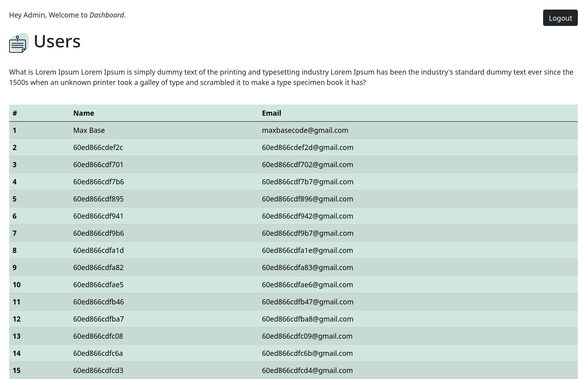
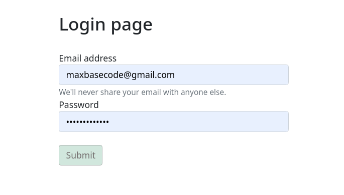
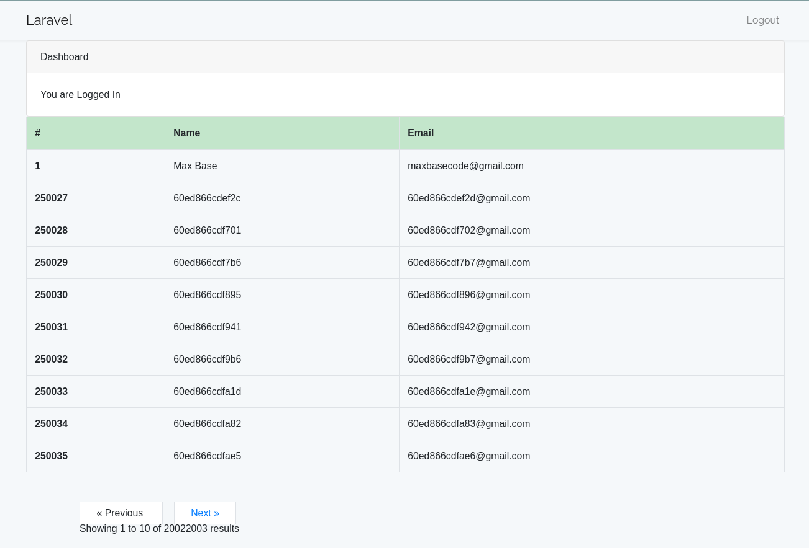
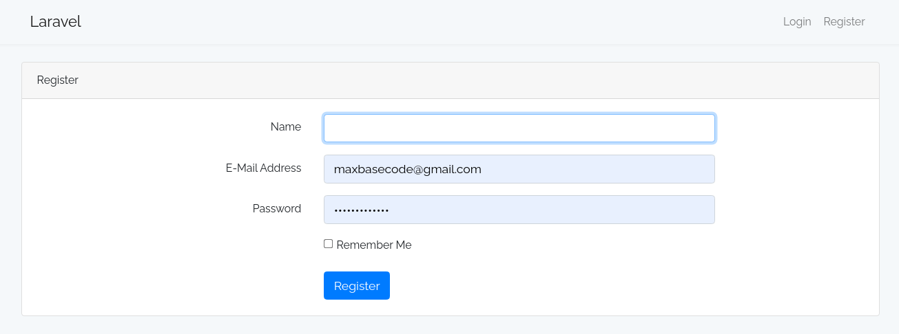
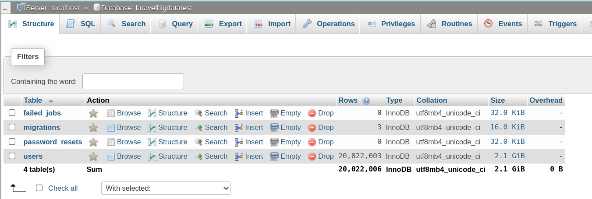

# Laravel Big Data Test

**PHP Laravel:** Develop a test environment in Laravel with more than 20 Million user rows. (A project in blade laravel and another SPA in vue js infinite scroll)

## Preview screenshots









## Routes

### Modern SPA Web (Vuejs version)

-   **GET:** [http://127.0.0.1:8000/spa/](http://127.0.0.1:8000/spa/)

#### Old Web

-   **GET:** [http://127.0.0.1:8000/](http://127.0.0.1:8000/) (Will redirect to login page or dashboard if you are already has verifieh auth)
-   **GET:** [http://127.0.0.1:8000/login](http://127.0.0.1:8000/login)
-   **GET:** [http://127.0.0.1:8000/registration](http://127.0.0.1:8000/registration)
-   **GET:** [http://127.0.0.1:8000/dashboard](http://127.0.0.1:8000/dashboard)
-   **GET:** [http://127.0.0.1:8000/fakeuser/](http://127.0.0.1:8000/fakeuser/)

#### Web-Forms/Action

-   **GET:** [http://127.0.0.1:8000/logout/](http://127.0.0.1:8000/logout/)
-   **POST:** [http://127.0.0.1:8000/post-login](http://127.0.0.1:8000/post-login)
-   **POST:** [http://127.0.0.1:8000/post-registration](http://127.0.0.1:8000/post-registration)

#### API

-   **POST:** [http://127.0.0.1:8000/api/login/](http://127.0.0.1:8000/api/login/)
-   **POST:** [http://127.0.0.1:8000/api/users/](http://127.0.0.1:8000/api/users/)
-   **POST:** [http://127.0.0.1:8000/api/users/:how_many_user_you_want/](http://127.0.0.1:8000/api/users/:how_many_user_you_want/)
-   **POST:** [http://127.0.0.1:8000/api/users/:per_page/:page_index/](http://127.0.0.1:8000/api/users/:per_page/:page_index/)

### Own artisan commands

-   Get list of all users and send an email to admin:

```
php artisan user:fetch
```

-   Insert +20M fake user data/rows:

```
php artisan user:fake
```

## Database

**Rows:** 20,022,003

**Size:** 2.1 GiB



## Performance

-   POST: `/api/login/` ; 137.73ms Waiting
-   POST: `/api/users/50/1/` ; 75.08ms Waiting (Maybe database cache, since the first page is so useable)
-   POST: `/api/users/50/60/` ; 174.57ms Waiting

#### PHP environment

```
$ php -v
PHP 8.0.7 (cli) (built: Jun  2 2021 04:04:16) ( NTS )
Copyright (c) The PHP Group
Zend Engine v4.0.7, Copyright (c) Zend Technologies
```

### Func Facts

Laravel internally support the **"Too Many Attempts"** error and not allow clients to send too many requests in a short period of time.

> In `app/Http/Kernel.php` Laravel has a default throttle limit for all api routes. [\[s\]](https://stackoverflow.com/a/43058691/10096230)

```php
protected $middlewareGroups = [
    ...
    'api' => [
        'throttle:60,1',
    ],
];
```

### Challenge (time and curl)

```
$ time curl 'http://localhost:8000/api/users/50/98700/'   -H 'Connection: keep-alive'   -H 'sec-ch-ua: " Not A;Brand";v="99", "Chromium";v="90", "Google Chrome";v="90"'   -H 'Accept: application/json, text/plain, */*'   -H 'X-XSRF-TOKEN: eyJpdiI6IkxITWpwdDZOZ2cvR3FLS1dYRjN3eEE9PSIsInZhbHVlIjoiRWg5UnlTU0J3aHVQbUtXSVhyMmZ0UDFlNXhlM2g1RTNKUXMzK0VtMlZza0FvRGxRQnl2MEZoWEVOM21vejhzTXZrL0ZMNlA2R3BmdGVUZkNQcWFqWW45VnJBSnZKU2Vta0RScmQvRGxUVklBK0V3UkpPSCt6SUVCSjEzemllVE8iLCJtYWMiOiI2MzUzMjUyZGY4ZjlkY2ZjYTQ0OWI0YWY4NWVmM2MyM2NjM2ZlMjFhMTUzYTgwNDQwZTA3NmNmMDA3ZGQwMGM1In0='   -H 'User-Sid: undefined'   -H 'User-Uid: undefined'   -H 'sec-ch-ua-mobile: ?0'   -H 'User-Agent: Mozilla/5.0 (X11; Linux x86_64) AppleWebKit/537.36 (KHTML, like Gecko) Chrome/90.0.4430.212 Safari/537.36'   -H 'Sec-Fetch-Site: same-origin'   -H 'Sec-Fetch-Mode: cors'   -H 'Sec-Fetch-Dest: empty'   -H 'Referer: http://localhost:8000/spa/'   -H 'Accept-Language: en,fa;q=0.9'   -H 'Cookie: _ga=GA1.1.1153724868.1621997033; PHPSID=827472f9a32fd841553ac5ca; _ga_G5D9ZS72L5=GS1.1.1625411801.47.1.1625412299.0; _xsrf=2|2a17c7f5|f3db1a448e0eb035e9fdabbce3701cb5|1625575302; username-localhost-8888="2|1:0|10:1625576831|23:username-localhost-8888|44:NjMzNDZiZjViZGI1NGIwYTgyNzcxOTRhNmNhMTlkMTk=|bff975294e789ed5ae6412429533018bab32a305f46f67decc611cd746f525d9"; XSRF-TOKEN=eyJpdiI6IkxITWpwdDZOZ2cvR3FLS1dYRjN3eEE9PSIsInZhbHVlIjoiRWg5UnlTU0J3aHVQbUtXSVhyMmZ0UDFlNXhlM2g1RTNKUXMzK0VtMlZza0FvRGxRQnl2MEZoWEVOM21vejhzTXZrL0ZMNlA2R3BmdGVUZkNQcWFqWW45VnJBSnZKU2Vta0RScmQvRGxUVklBK0V3UkpPSCt6SUVCSjEzemllVE8iLCJtYWMiOiI2MzUzMjUyZGY4ZjlkY2ZjYTQ0OWI0YWY4NWVmM2MyM2NjM2ZlMjFhMTUzYTgwNDQwZTA3NmNmMDA3ZGQwMGM1In0%3D; laravel_session=eyJpdiI6InNmVXVNaXZtaExDdjU0bE9EY0gxSEE9PSIsInZhbHVlIjoid3lOaW9MWHNUU3lKK29oMTRWNVhkaktvTTBCNUh1RGdwNStCWVZ1ZWtDUzAwVXNRZFpCbHIydXRJOURLWDN0N1dVTDk0dWVvWko1WHg0QTBPeTB5clFMZXFVZ0NRRjREWlZ3ckFtVGVVcitCMU0wUUZxanVPUTlJYlRxeFRFSUoiLCJtYWMiOiJlZjY2ZWJjMjhjMjhmZGIyZWE4ZmNlYjY3NGI5OGEzYmE1M2UzMWVjNGQwOTI1NGI0NjNkMjlhMmMzNmMxNThiIn0%3D'   --compressed

real	0m1.179s
user	0m0.010s
sys	0m0.004s

real	0m0.983s
user	0m0.003s
sys	0m0.006s

real	0m1.012s
user	0m0.008s
sys	0m0.007s
```

---

## Laravel

<p align="center"><a href="https://laravel.com" target="_blank"></a></p>

<p align="center">
<a href="https://travis-ci.org/laravel/framework"></a>
<a href="https://packagist.org/packages/laravel/framework"></a>
<a href="https://packagist.org/packages/laravel/framework"></a>
<a href="https://packagist.org/packages/laravel/framework"></a>
</p>

### About Laravel

Laravel is a web application framework with expressive, elegant syntax. We believe development must be an enjoyable and creative experience to be truly fulfilling. Laravel takes the pain out of development by easing common tasks used in many web projects, such as:

-   [Simple, fast routing engine](https://laravel.com/docs/routing).
-   [Powerful dependency injection container](https://laravel.com/docs/container).
-   Multiple back-ends for [session](https://laravel.com/docs/session) and [cache](https://laravel.com/docs/cache) storage.
-   Expressive, intuitive [database ORM](https://laravel.com/docs/eloquent).
-   Database agnostic [schema migrations](https://laravel.com/docs/migrations).
-   [Robust background job processing](https://laravel.com/docs/queues).
-   [Real-time event broadcasting](https://laravel.com/docs/broadcasting).

Laravel is accessible, powerful, and provides tools required for large, robust applications.

### Learning Laravel

Laravel has the most extensive and thorough [documentation](https://laravel.com/docs) and video tutorial library of all modern web application frameworks, making it a breeze to get started with the framework.

If you don't feel like reading, [Laracasts](https://laracasts.com) can help. Laracasts contains over 1500 video tutorials on a range of topics including Laravel, modern PHP, unit testing, and JavaScript. Boost your skills by digging into our comprehensive video library.

### Laravel Sponsors

We would like to extend our thanks to the following sponsors for funding Laravel development. If you are interested in becoming a sponsor, please visit the Laravel [Patreon page](https://patreon.com/taylorotwell).

#### Premium Partners

-   **[Vehikl](https://vehikl.com/)**
-   **[Tighten Co.](https://tighten.co)**
-   **[Kirschbaum Development Group](https://kirschbaumdevelopment.com)**
-   **[64 Robots](https://64robots.com)**
-   **[Cubet Techno Labs](https://cubettech.com)**
-   **[Cyber-Duck](https://cyber-duck.co.uk)**
-   **[Many](https://www.many.co.uk)**
-   **[Webdock, Fast VPS Hosting](https://www.webdock.io/en)**
-   **[DevSquad](https://devsquad.com)**
-   **[Curotec](https://www.curotec.com/services/technologies/laravel/)**
-   **[OP.GG](https://op.gg)**

### Contributing

Thank you for considering contributing to the Laravel framework! The contribution guide can be found in the [Laravel documentation](https://laravel.com/docs/contributions).

### Code of Conduct

In order to ensure that the Laravel community is welcoming to all, please review and abide by the [Code of Conduct](https://laravel.com/docs/contributions#code-of-conduct).

### Security Vulnerabilities

If you discover a security vulnerability within Laravel, please send an e-mail to Taylor Otwell via [taylor@laravel.com](mailto:taylor@laravel.com). All security vulnerabilities will be promptly addressed.

### License

The Laravel framework is open-sourced software licensed under the [MIT license](https://opensource.org/licenses/MIT).
